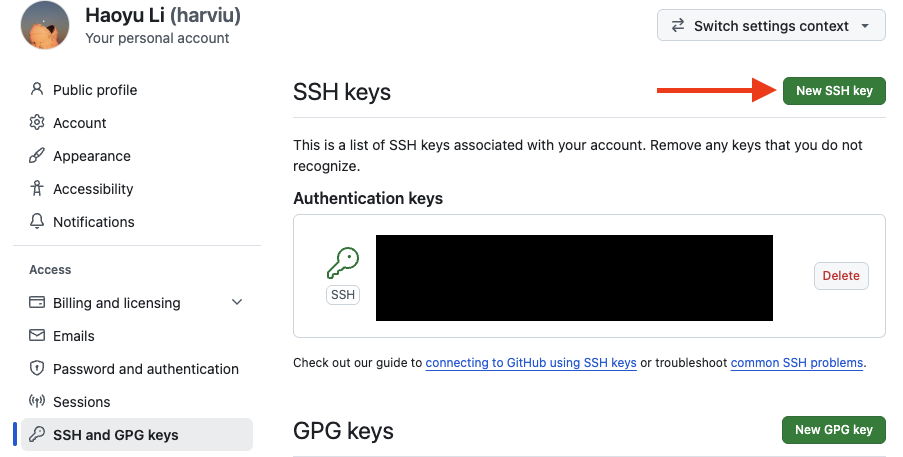
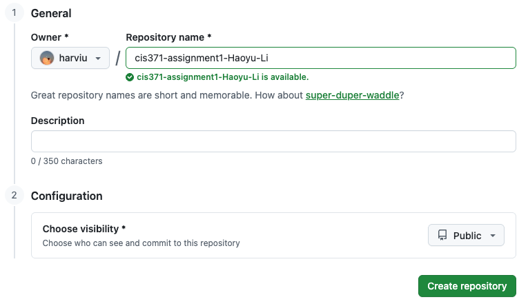
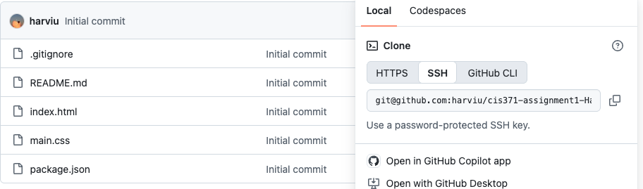
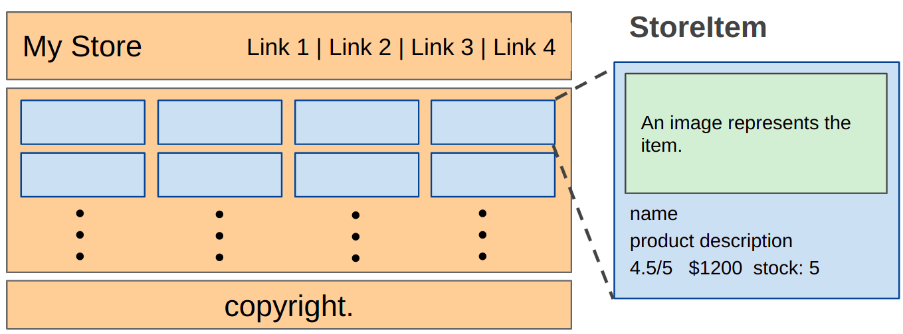
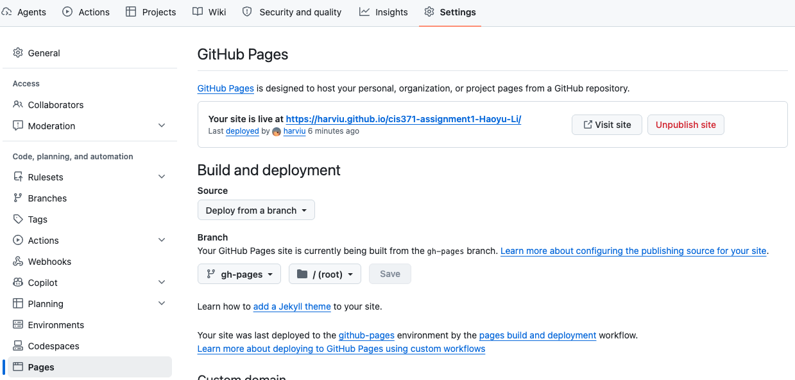

# CSS + HTML

Build a static online store showcasing your proficiency in fundamental CSS and HTML.

## Objectives

- Structuring webpage content with HTML.
- Using CSS Grid and Flexbox for page layout.
- Managing source code and version control with GitHub.
- Deploying the website on GitHub Pages.

## Preparation

- **IDE Setup:** Use [VS Code](https://code.visualstudio.com/) for editing and managing your code.
- **Development Environment:**

  1. **Node.js Environment Setup:** Install Node.js 22.12 or later using one of the following options:

     - Docker Container: Create a Node.js development environment with Docker. For detailed instructions, please refer to the [class slides](../assets/pdf/Docker.pdf).
     - Direct Install: Alternatively, you can install Node.js directly from the [Node.js official website](https://nodejs.org).

     In the context of this document, the term `terminal` refers to:

     - Command Prompt: On Windows systems.
     - Terminal: On macOS systems.
     - Shell or Bash: Inside a Docker container, depending on the base image of the container.

     Verify the installation by running the following commands in your `terminal`:

     ```bash
     node -v    # v22.12 or later
     npm -v     # npm is included with Node.js
     ```

  2. **GitHub Setup:**

     1. Create a [GitHub account](https://github.com) if you don't have one.
     2. Ensure you can access your GitHub account using an SSH key. If you haven't set this up, follow the steps below or check this [tutorial](https://youtu.be/a-zX_qc2S-M).

        - Open a `terminal`. If you haven't yet configured an SSH key for GitHub on your machine, generate a new one with the following command:

          ```bash
          ssh-keygen
          ```

        - Navigate to your GitHub account settings on the website. Click on `SSH and GPG keys` and then `New SSH key`. Paste the public key that was generated in the first step and click `Add SSH key`.

          

        - Set up your GitHub username and email in a `terminal`. You can do this with the following commands:

          ```bash
          git config --global user.name "Your Name"
          git config --global user.email "your-email@example.com"
          ```

  3. Set up your project repository.

     1. **Use the Assignment Template:** Open the [Assignment 1 template](https://github.com/harviu/cis371-assignment1). Click **Use this template**, then select **Create a new repository**.
     2. **Name Your Repository:** Name your repository `cis371-assignment1-FirstName-LastName`, replacing `FirstName` and `LastName` with your own name.

        

     3. **Clone the Repository:**

        

        In your `terminal`, use the following command with your SSH repository link to clone the repository to your local machine:

        ```bash
        git clone [YOUR_SSH_REPO_LINK]
        ```

     4. **Install Required Packages:** Run the following commands to install the necessary packages for your project:

        ```bash
        cd [YOUR_REPO]
        npm install
        ```

  4. Run a local development server (default port 5173):

     ```bash
     npm run dev
     ```

     Then open `http://localhost:5173` in your browser.

## Instructions

For your project, you will work with `index.html` and `main.css`. Write CSS code in `main.css` to complete the following tasks:

- **Layout:** Implement a 3-row layout using CSS Grid: Header, Main, and Footer.

  - Ensure there is no horizontal scroll.

- **Header:** Position the store's name at the top left and navigation links at the top right.
- **Footer:** Display a copyright notice.

- **Main:** Display all store items.

  - Maintain equal space between all items, ensuring that both the ends (left and right) and the space between item blocks are evenly spaced.
  - Each row should display 4 items.
  - Store items should automatically wrap to the next row after every 4 items.
  - The height of the main container should be dynamic, adjusting automatically based on the number of items displayed, with rows expanding as more items are added. Ensure there is no horizontal or vertical scrolling within the main container.

- **store-item:** Style the item information.

  - All store items should have the same height and width.
  - Display the rating, price, and stock information on the same row within each store item.

- **Overall:**

  - The layout should fill the browser’s width without causing horizontal scrolling.

  

## Grading Rubric

| Grading Item | Points |
| --- | --: |
| **GitHub Setup with SSH Key, Clone, Commit, Push, & Deploy to GitHub Pages** | 15 |
| **Layout** | 10 |
| **Header** | 10 |
| **Footer** | 10 |
| **Main** | 25 |
| **store-item** | 20 |
| **Visual Design and Aesthetics** | 10 |

## Deliverables

- Deploy your web application using the following commands in your `terminal`:

  ```bash
  npm run build
  npm run deploy
  ```

- **GitHub Pages Setup:**

  - GitHub Pages setup is handled automatically by the deployment process. To view the configuration, open your repository’s **Settings → Pages**.

    

  - Your web application will be accessible at the URL: `https://[GITHUB_ID].github.io/[YOUR_REPO]/`

- Submit your GitHub Pages URL in Blackboard.
